<p align="center">
  
</p>

<h1 align="center"></h1>

<p align="center">
  <strong>Proof before payout.</strong>
</p>

<p align="center">
  A mainnet proof registry for Web3 grant milestones. WalProof stores milestone evidence and proof packets on Walrus, registers compact proof references on Sui mainnet, and verifies chain state through Tatum's Sui RPC gateway.
</p>

<p align="center">
  <a href="#live-mainnet-verification">Mainnet Verification</a>
  |
  <a href="#product-walkthrough">Product Walkthrough</a>
  |
  <a href="#contract">Move Contract</a>
</p>

---

## What WalProof Is

WalProof is a proof registry for teams that fund builders in milestones.

When a builder says, "Milestone complete, please approve payout," the sponsor needs more than a chat message or a loose image in a thread. The sponsor needs evidence, storage proofs, a chain record, a review decision, and a public page that anyone can inspect later.

WalProof creates that trail:

1. A sponsor or grant operator creates a **Grant Room**.
2. A builder uploads **Milestone Evidence**.
3. Evidence files are stored as **Walrus Blobs**.
4. WalProof builds a JSON **Proof Packet** from the milestone, evidence metadata, blob IDs, hashes, wallets, and timestamps.
5. The Proof Packet is also stored on Walrus.
6. A compact reference to that packet is registered through the deployed **Sui Move registry contract**.
7. The app verifies the transaction and object through **Tatum Sui RPC**.
8. A reviewer records a **Funding Decision**.
9. The public proof page shows the whole Verification Trail.

WalProof is intentionally not an escrow. It does not custody funds, hold grant money, release payouts, or move tokens. It answers one question very well:

> Can this milestone's proof be inspected before payout?

---

## Non-Negotiable Proof Rules

WalProof follows strict proof rules because weak proof registries are worse than no proof registry.

| Rule | What WalProof Enforces |
| --- | --- |
| No fake storage | Evidence must have a real Walrus blob ID before it can be treated as stored evidence. |
| No fake verification | The UI only says "Verified through Tatum" after the server-side Tatum RPC route confirms the Sui transaction or object. |
| No exposed RPC key | `TATUM_API_KEY` is never imported into client components. It is used only inside Next.js API routes. |
| No private key handling | Wallets sign transactions client-side through Mysten dApp Kit. |
| No pretending private mode exists | Public blob IDs are public. Private encrypted evidence is a future feature, not a fake checkbox. |
| No bloated on-chain payloads | Large files live on Walrus. Sui stores compact references, hashes, statuses, event data, and object records. |
| No payout custody | WalProof records proof before payout. It does not transfer grant funds. |
| No silent integration failure | Missing Tatum, Walrus, package, wallet, gas, or WAL balance shows a visible failure state. |

---

## Live Mainnet Verification

This repository includes real public mainnet artifacts so reviewers can verify the project without trusting presentation images.

### Sui Mainnet Package

| Item | Value |
| --- | --- |
| Network | `mainnet` |
| Package ID | `0xcb2de9abb7cac5c70ff2e24854ff2595ce4087148329e32dacb0b9bceebe9a3e` |
| Module | `registry` |
| Publish transaction | `CvhpmVxAZFebebEberaqCYBnYdWZmvguBMmhz6S8CGua` |
| UpgradeCap | `0x5f75a8efa35f44adaa37040e8b3af5710d5e105df50e4e564a3b28ecb7912eb9` |

Open package:

```txt
https://suiscan.xyz/mainnet/object/0xcb2de9abb7cac5c70ff2e24854ff2595ce4087148329e32dacb0b9bceebe9a3e
```

Open publish transaction:

```txt
https://suiscan.xyz/mainnet/tx/CvhpmVxAZFebebEberaqCYBnYdWZmvguBMmhz6S8CGua
```

### Real Proof Packet On Walrus

| Item | Value |
| --- | --- |
| Walrus blob ID | `m_wOf8Q5RgMCFb_Uo3Zoxk-ie63miM99_xP9f54SjP0` |
| Blob object | `0x6bbc1882d79885fc0353e0c874bb61ffbf9f65ea0ca2ad6d6635e1867420905c` |
| Content hash | `94388789e65e4780f2a3ef304a1915ea3044061153172a1532d29001dcd812f9` |
| Size | `1420 bytes` |
| MIME type | `application/json` |

Read through official Walrus aggregator:

```txt
https://aggregator.walrus-mainnet.walrus.space/v1/blobs/m_wOf8Q5RgMCFb_Uo3Zoxk-ie63miM99_xP9f54SjP0
```

Read through the app proxy:

```txt
/api/walrus/read?blobId=m_wOf8Q5RgMCFb_Uo3Zoxk-ie63miM99_xP9f54SjP0
```

### Real Proof Registered On Sui

| Item | Value |
| --- | --- |
| Proof submit transaction | `D8AoW5gGBNgCyw4a2bdQyoDQrjjWKMR5FFp6eK7HzNRp` |
| Proof object | `0xfc69fa3c8cd6ae140db7e58db739e0f7d887ee5daabbe25b35267f1aae55154b` |
| Object type | `walproof_registry::registry::MilestoneProof` |
| Status | `1 = submitted` |
| Public page alias | `/proof/demo-proof` |

Open proof transaction:

```txt
https://suiscan.xyz/mainnet/tx/D8AoW5gGBNgCyw4a2bdQyoDQrjjWKMR5FFp6eK7HzNRp
```

Open proof object:

```txt
https://suiscan.xyz/mainnet/object/0xfc69fa3c8cd6ae140db7e58db739e0f7d887ee5daabbe25b35267f1aae55154b
```

### Seeded Mainnet Records In The App

The dashboard ships with public mainnet seed records so a deployed Vercel build immediately has real records to inspect.

| Count | Meaning |
| ---: | --- |
| 11 | Real Grant Room seed records created on Sui mainnet |
| 12 | Mainnet Sui records shown in the app, including the submitted proof |
| 1 | Real Walrus proof packet currently displayed in the public proof flow |
| 1 | Pending Sponsor Review item for the real proof |

Mainnet artifact files are stored in:

```txt
public/mainnet-records/
```

## Product Walkthrough

This walkthrough follows the product from first promise to public verification. Each surface exists to prove a specific part of the WalProof system: what it does, where proof is stored, how verification happens, and how a sponsor reaches a funding decision.

### Proof Before Payout

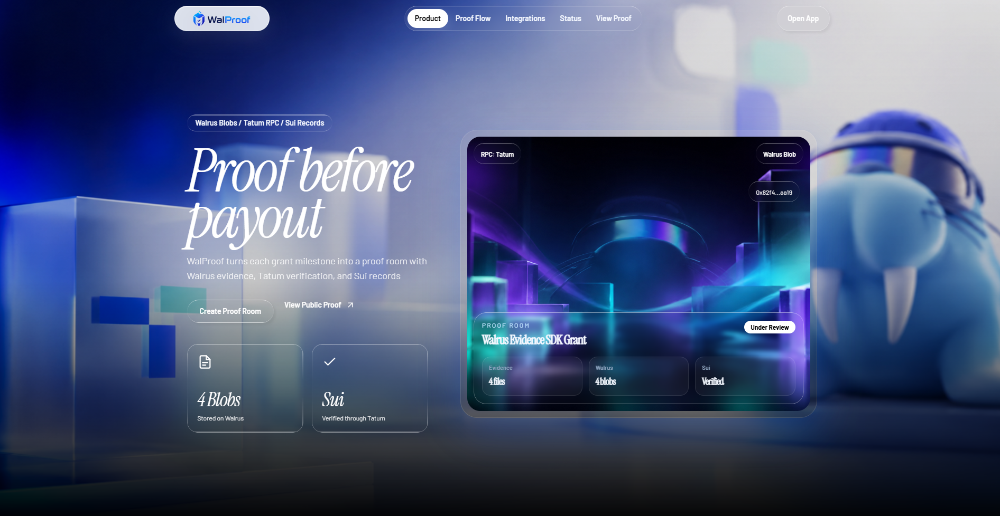

This is the first product promise. The landing page makes the proof stack visible immediately: Walrus blobs, Tatum RPC, and Sui records. The hero is not just visual polish. It tells the sponsor what WalProof does before they ever enter the app:

- evidence is stored on Walrus
- proof records are registered on Sui
- verification is powered by Tatum RPC
- public proof is the product outcome

### Proof Flow And Integrations

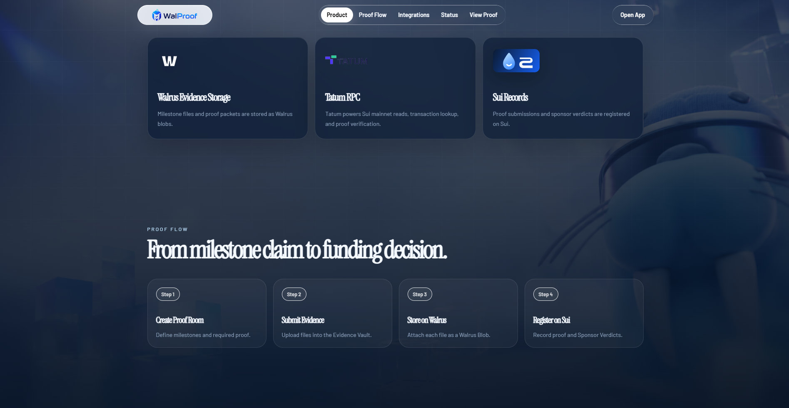

This section explains the core workflow in four actions:

1. Create Proof Room.
2. Submit Evidence.
3. Store on Walrus.
4. Register on Sui.

The integration cards above the flow deliberately separate the infrastructure responsibilities:

- **Walrus Evidence Storage** stores milestone files and proof packets.
- **Tatum RPC** verifies Sui mainnet reads, transaction lookup, and object verification.
- **Sui Records** register proof submissions and sponsor verdicts.

### Evidence Vault Preview

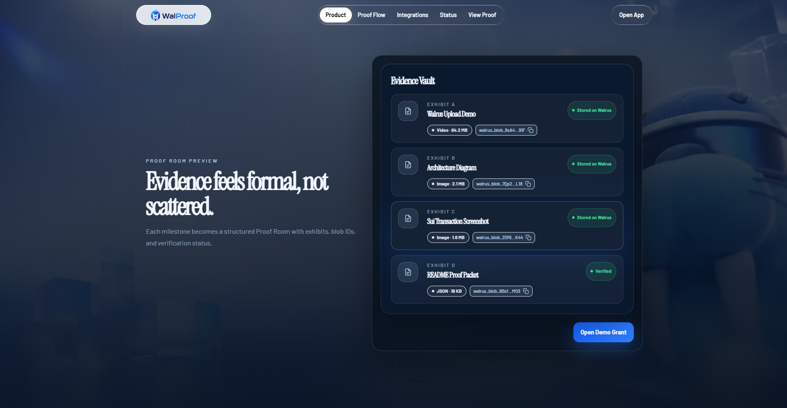

The Evidence Vault is the anti-chaos layer. Instead of letting grant proof scatter across social messages, cloud drives, and private chats, WalProof groups files as exhibits:

- Exhibit A: upload demo
- Exhibit B: architecture diagram
- Exhibit C: Sui transaction proof
- Exhibit D: proof packet

Every exhibit is tied to a blob ID, file type, size, and status.

### Sponsor Review And Final CTA

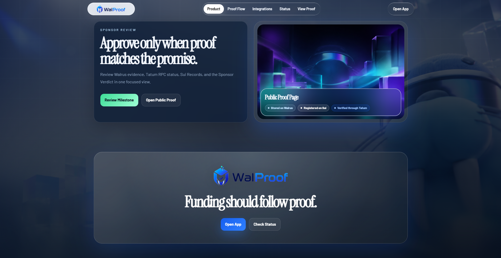

This surface clarifies the reviewer job:

> Approve only when proof matches the promise.

The reviewer sees Walrus evidence, Tatum verification, Sui records, and public proof state before making a funding decision. The CTA avoids payout language because WalProof is not an escrow. It is a verification layer before payout.

### Public Proof Page With Mainnet Verification

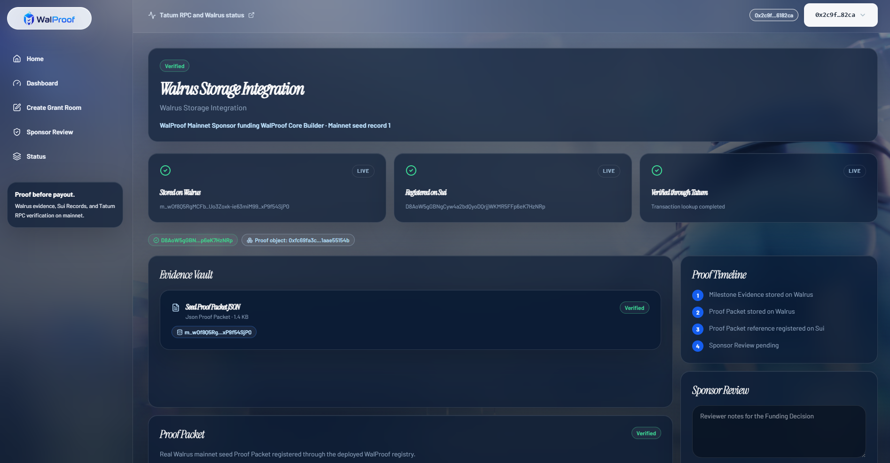

This is the main verification surface. It shows the public proof record for the real mainnet proof packet.

Visible proof states:

- **Stored on Walrus**: real blob ID exists.
- **Registered on Sui**: real Sui transaction exists.
- **Verified through Tatum**: transaction lookup completed through the server-side Tatum route.

The transaction and proof object pills open Suiscan. The Walrus blob pill opens the app read proxy for the blob.

### Create Grant Room

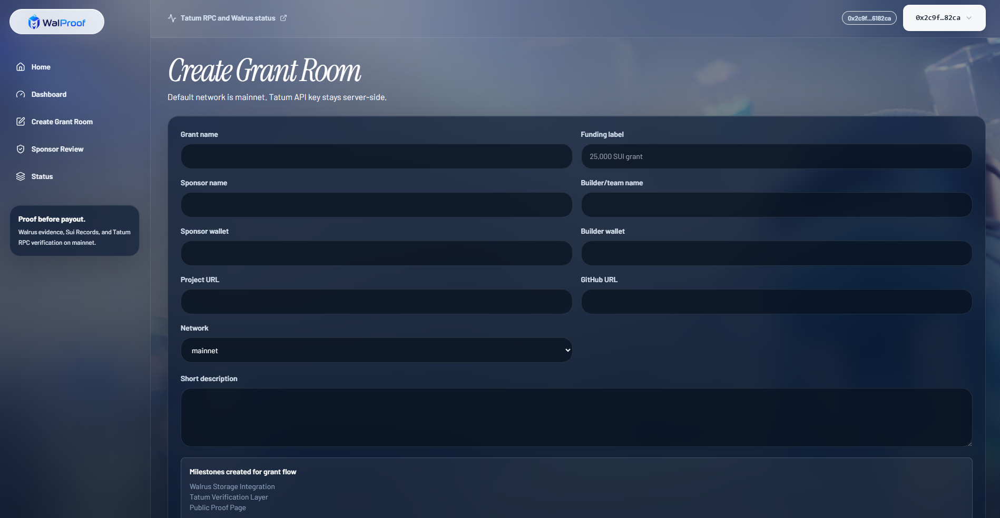

This page creates the grant container. It captures:

- grant name
- sponsor and builder names
- sponsor and builder wallets
- project and GitHub URLs
- network, defaulting to mainnet
- grant description
- default milestone structure

The form validates wallet addresses and required fields. When used live, metadata upload goes through the wallet-backed Walrus SDK flow, then the Sui create transaction is signed client-side.

### Sponsor Review Queue

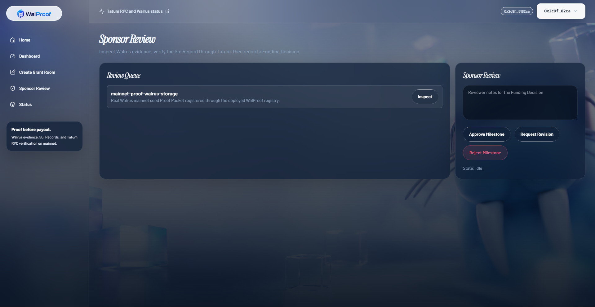

The review page lists pending Proof Packets. The reviewer can inspect proof, add review notes, upload a review packet to Walrus, and record a funding decision on Sui.

Review decisions:

- Approve Milestone
- Request Revision
- Reject Milestone

The contract records the reviewer wallet transparently. The UI does not pretend a private sponsor key exists on the server.

### Infrastructure Status

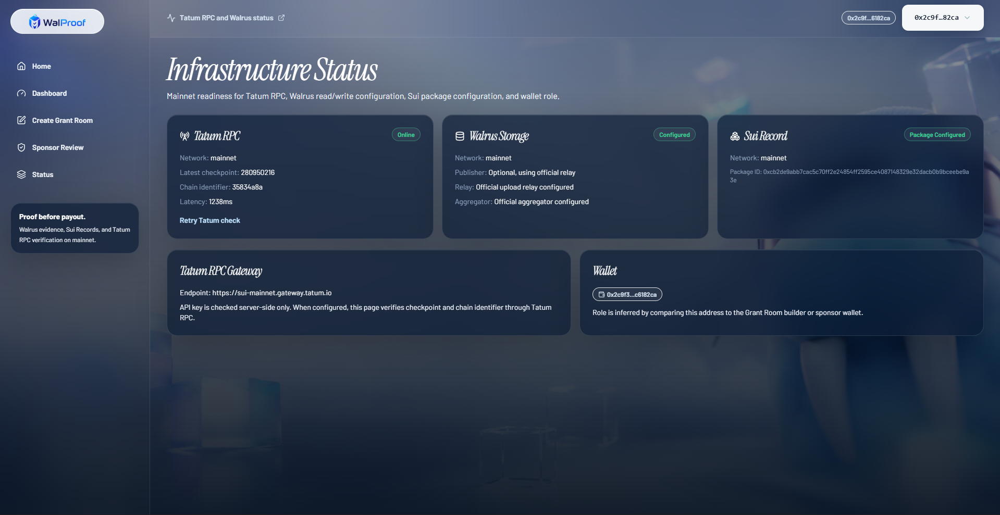

The status page is the live integration proof panel.

It shows:

- Tatum RPC online state
- Sui mainnet network
- latest checkpoint
- chain identifier
- RPC latency
- Walrus relay and aggregator configuration
- deployed Sui package ID
- connected wallet role context

This is where judges can quickly see whether the app is configured for real mainnet operations.

### Dashboard With Mainnet Records

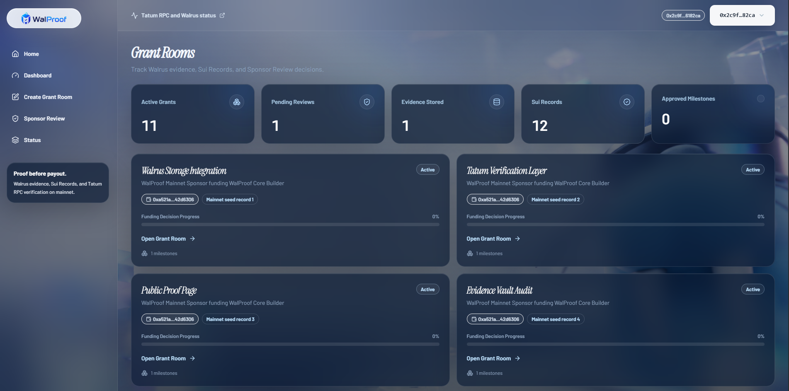

The dashboard shows the indexed Grant Rooms and proof counts. The displayed records are not empty placeholders. They include real mainnet seed records so the deployed app has public proof surfaces immediately.

Dashboard metrics:

- Active Grants
- Pending Reviews
- Evidence Stored
- Sui Records
- Approved Milestones

---

## Proof Trail

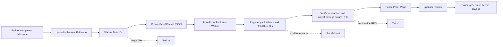

## Trust Boundaries

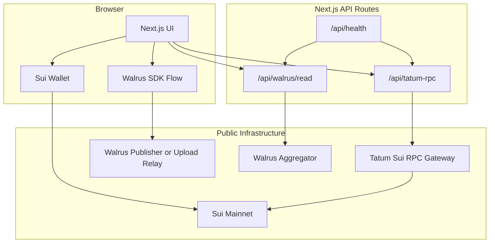

## Data Placement

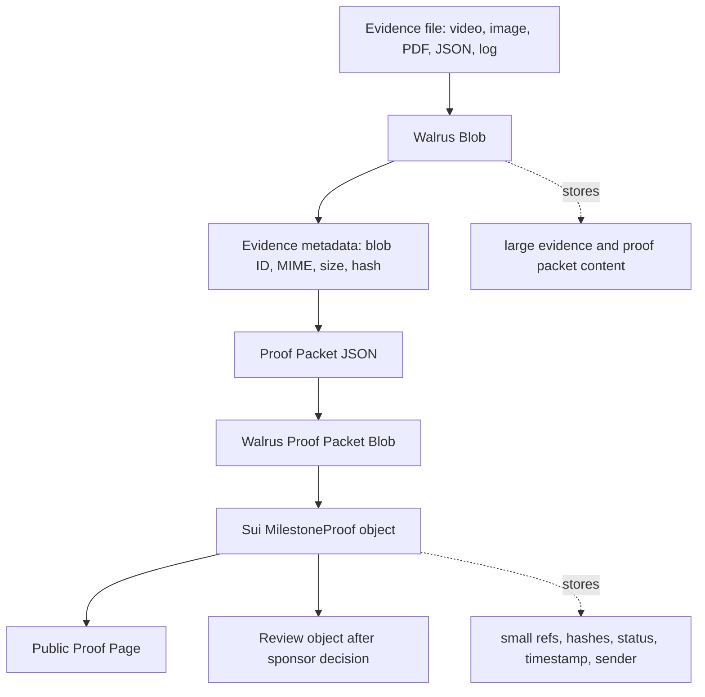

## Submit Proof State Machine

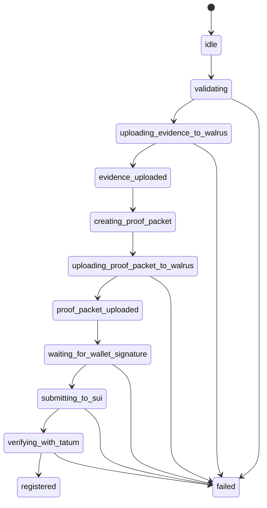

---

## Product Surfaces

| Route | Purpose | What A Judge Should See |
| --- | --- | --- |
| `/` | Landing page | Product story, proof flow, Walrus/Tatum/Sui positioning |
| `/dashboard` | Grant Rooms | Real mainnet seed records and metrics |
| `/grants/new` | Create Grant Room | Mainnet form, wallet-signed create path, Walrus metadata upload |
| `/grants/[grantId]` | Grant detail | Milestones, Evidence Vault, proof packet, Sui and Tatum status |
| `/grants/[grantId]/milestones/[milestoneId]/submit` | Builder proof submission | Evidence upload, proof packet creation, Sui registration, Tatum verification |
| `/review` | Sponsor Review | Pending proofs and review decision actions |
| `/proof/demo-proof` | Public Proof Page | Real Walrus blob, real Sui proof object, real Tatum verification |
| `/status` | Infrastructure Status | Live Tatum, Walrus, package, wallet readiness |

---

## Architecture

WalProof is split by responsibility.

```txt
app/
  pages and API routes

components/
  app shell, navigation, proof cards, evidence cards, status cards

lib/
  env, config, schemas, Tatum client, Walrus client, Sui client,
  contract builders, proof packet creation, local metadata adapter

move/
  walproof_registry Move package

public/
  project assets, real mainnet record artifacts

docs/
  product walkthrough media
```

Core client flow:

```txt
React form
  -> Zod validation
  -> wallet connection check
  -> Walrus SDK upload
  -> local content hash
  -> Proof Packet JSON
  -> Walrus SDK upload
  -> Sui Transaction builder
  -> dApp Kit wallet signing
  -> Tatum RPC verification
  -> local/seed metadata adapter
  -> Public Proof Page
```

Core server flow:

```txt
Client
  -> /api/tatum-rpc
  -> method allowlist
  -> x-api-key: process.env.TATUM_API_KEY
  -> Tatum Sui RPC endpoint
  -> JSON-RPC response
```

---

## Why Walrus

Grant proof usually includes files:

- demo videos
- visual evidence
- GitHub proof
- deployment evidence
- PDFs
- logs
- JSON records
- final reports

Those files do not belong directly on-chain. Walrus is used as the decentralized storage layer for the heavy content. WalProof stores blob IDs and hashes in proof packets and Sui records so the public page can reference evidence without bloating the contract.

WalProof currently supports:

- PNG
- JPG
- WEBP
- MP4
- MOV
- PDF
- JSON
- TXT
- MD
- LOG

Default file limits:

| File Class | Limit |
| --- | ---: |
| Images | 10 MB |
| PDF/docs | 20 MB |
| Videos | 100 MB |

---

## Why Tatum

Tatum is the app's Sui mainnet RPC gateway for reads and verification. WalProof does not expose the Tatum API key to the browser.

Server-side route:

```txt
app/api/tatum-rpc/route.ts
```

Allowlisted methods:

- `sui_getLatestCheckpointSequenceNumber`
- `sui_getCheckpoint`
- `sui_getTransactionBlock`
- `sui_getObject`
- `sui_multiGetObjects`
- `sui_getBalance`
- `sui_getChainIdentifier`
- `sui_getTotalTransactionBlocks`
- `sui_devInspectTransactionBlock`
- `suix_getOwnedObjects`

Rejected methods return an error instead of being blindly proxied.

The status page uses Tatum to show:

- connected state
- network
- latest checkpoint
- chain identifier
- latency
- error state
- server-side API key detection

---

## Why Sui

Sui is used for durable proof registry records. WalProof uses Sui for proof references, not file storage and not escrow.

The contract creates:

- `Grant`
- `MilestoneProof`
- `Review`

The contract emits:

- `GrantCreated`
- `ProofSubmitted`
- `ProofReviewed`

The contract stores:

- sender/reviewer addresses
- sponsor/builder references where needed
- grant and milestone refs
- Walrus proof packet blob IDs
- proof/review hashes
- timestamps
- status values

The contract does not:

- store large files
- custody private keys
- move payout funds
- perform DAO voting
- pretend review was sponsor-only unless signer validation is explicit

---

## Contract

Move package:

```txt
move/walproof_registry
```

Module:

```move
walproof_registry::registry
```

Entry functions:

```move
public entry fun create_grant(
    sponsor: address,
    builder: address,
    metadata_hash: vector<u8>,
    created_at_ms: u64,
    ctx: &mut TxContext
)

public entry fun submit_proof(
    grant_ref: vector<u8>,
    milestone_ref: vector<u8>,
    sponsor: address,
    proof_packet_blob_id: vector<u8>,
    proof_packet_hash: vector<u8>,
    created_at_ms: u64,
    ctx: &mut TxContext
)

public entry fun review_proof(
    proof_ref: vector<u8>,
    decision: u8,
    review_packet_blob_id: vector<u8>,
    review_packet_hash: vector<u8>,
    created_at_ms: u64,
    ctx: &mut TxContext
)
```

Decision status mapping:

| Value | Meaning |
| ---: | --- |
| 1 | approved |
| 2 | revision_requested |
| 3 | rejected |

Proof status mapping:

| Value | Meaning |
| ---: | --- |
| 1 | submitted |
| 2 | approved |
| 3 | revision_requested |
| 4 | rejected |

Tests cover:

- grant creation
- proof submission
- valid review decisions
- invalid review decision rejection
- event/object behavior

---

## Move Build And Publish

Use testnet before mainnet when changing contract code.

```bash
cd move/walproof_registry
sui move build
sui move test
sui client switch --env mainnet
sui client publish --gas-budget 100000000
```

After publish:

```env
NEXT_PUBLIC_WALPROOF_PACKAGE_ID=0x...
NEXT_PUBLIC_WALPROOF_REGISTRY_MODULE=registry
```

## How A Real User Uses It

### Sponsor

1. Create a Grant Room.
2. Add sponsor and builder wallet addresses.
3. Define milestone evidence expectations.
4. Wait for builder submission.
5. Review the public proof trail.
6. Approve, reject, or request revision.
7. Use the public proof page as the audit artifact before payout.

### Builder

1. Open the Grant Room.
2. Select a milestone.
3. Upload evidence to Walrus.
4. Create a Proof Packet.
5. Sign the Sui transaction to register proof.
6. Share the Public Proof Page.

### Public Reviewer

1. Open the proof URL.
2. Read evidence metadata.
3. Open Walrus blob.
4. Open Sui transaction and object.
5. Confirm Tatum verification state.
6. Inspect sponsor review outcome.

## Security Model

WalProof protects the critical boundaries:

- Tatum API key is server-side only.
- Wallet signing is client-side only.
- No server private keys.
- No grant payout custody.
- No token transfer.
- No hidden sponsor impersonation.
- Public blob IDs are treated as public.
- API route input is validated.
- Tatum RPC methods are allowlisted.
- Service role keys are never exposed to the browser.

Live upload requirements:

- connected Sui wallet
- enough SUI for gas
- enough WAL for Walrus storage
- user approval for wallet transactions

If any requirement is missing, WalProof shows a failure state instead of pretending success.

---

## Testing

TypeScript:

```bash
npm run typecheck
```

Production build:

```bash
npm run build
```

Move:

```bash
cd move/walproof_registry
sui move build
sui move test
```

Manual integration checklist:

- open `/status`
- verify Tatum mainnet checkpoint
- verify chain identifier
- open `/proof/demo-proof`
- read Walrus blob
- open Sui transaction on Suiscan
- open Sui proof object on Suiscan
- create Grant Room with connected wallet
- upload evidence with connected wallet
- create Proof Packet
- register proof on Sui
- verify transaction through Tatum
- review proof
- verify review transaction

---

## Final Summary

WalProof is a grant proof registry built around a simple rule:

> Funding decisions should follow verifiable proof, not scattered claims.

The app demonstrates that rule with real mainnet infrastructure:

- Walrus stores milestone evidence and Proof Packets.
- Sui mainnet registers compact proof records and review records.
- Tatum verifies Sui state through a protected server-side RPC route.
- Public proof pages expose the Verification Trail for sponsors, builders, and reviewers.

WalProof does not pretend to be an escrow, a storage fake, or a local-only demo. It is a focused proof layer for Web3 grants: proof before payout.

<p align="center">
  
  &nbsp;&nbsp;&nbsp;&nbsp;
  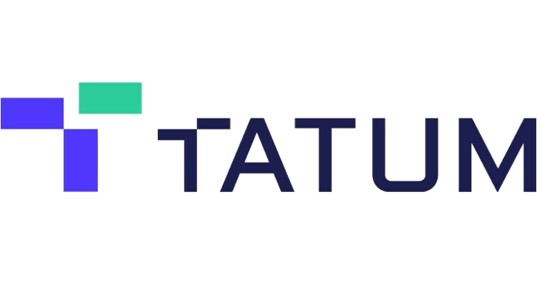
  &nbsp;&nbsp;&nbsp;&nbsp;
  
</p>
